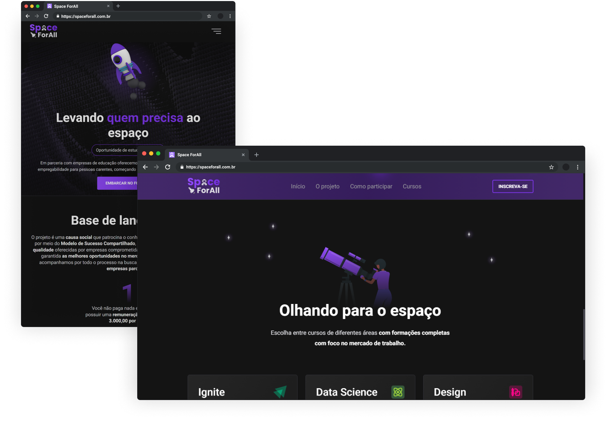

<h1 align="center">
  
</h1>

<p align="center">
  <a href="#dowhile-challenge">Desafio</a>&nbsp; · &nbsp;
  <a href="#project">Projeto</a>&nbsp; · &nbsp;
  <a href="#layout">Layout</a>&nbsp; · &nbsp;
  <a href="#technologies">Tecnologias</a>
</p>

<div>
  
</div>

## Desafio - DoWhile2021

<p id="dowhile-challenge">
  Desafio proposto no evento do <a href="https://dowhile.io/">DoWhile</a> pelo pessoal da <a href="https://rocketseat.com.br/">Rocketseat</a> para o programa de bolsas patrocinado pelas empresas parceiras. <br />
  O desafio consistia em desenvolver uma aplicação estilo <strong>Landing Page</strong>, utilizando uma das tecnologias apresentadas e com o tema abaixo:

```
  Pensando em construir o futuro, como você solucionaria os problemas
  de acesso à educação hoje, utilizando a tecnologia?
```

Para melhor entendimento do desafio em si acesse: <a href="https://efficient-sloth-d85.notion.site/Instru-es-dos-desafios-f2f2c5574cf640c59de425413f60c8eb?p=f155a3fc310744b9b57557f7485c8153">Desafio - DoWhile2021</a> <br />

:warning: Um ponto a se destacar é que o layout foi criado com ajuda do meu grande amigo [Estevão Gabriel](https://github.com/EST3V4O), onde cada um desenvolveu sozinho esta aplicação utilizando tecnologias diferentes, mudando alguns aspectos visuais.

</p>

## :bulb: Uma ideia

<p id="project">
  A idea do projeto é uma plataforma que <strong>patrocina o conhecimento</strong> e evolução de pessoas carentes por meio do <strong>Modelo de Sucesso Compartilhado</strong>, disponibilizando acesso a <strong>formações de qualidade</strong> oferecidas por empresas comprometidas com a educação. 
</p>

## :art: Layout

<p id="layout">
  Utilizamos para criação do layout o <a href="https://www.figma.com/">Figma</a>. Você pode visualizar através <a href="https://www.figma.com/file/WuMojlB5b02R0qOU1tNObQ/Space-ForAll?node-id=98%3A5">desse link<a/>. Lembrando que você precisa ter uma conta no Figma para acessá-lo.
</p>

## :rocket: Tecnologias

<p id="technologies">Optei por escolher as tecnologias abaixo para o desenvolvimento do projeto</p>

- HTML
- JavaScript
- CSS
- [Animate.css](https://animate.style/)
- [ScrollReveal](https://scrollrevealjs.org/)
- [Swiper](https://swiperjs.com)
